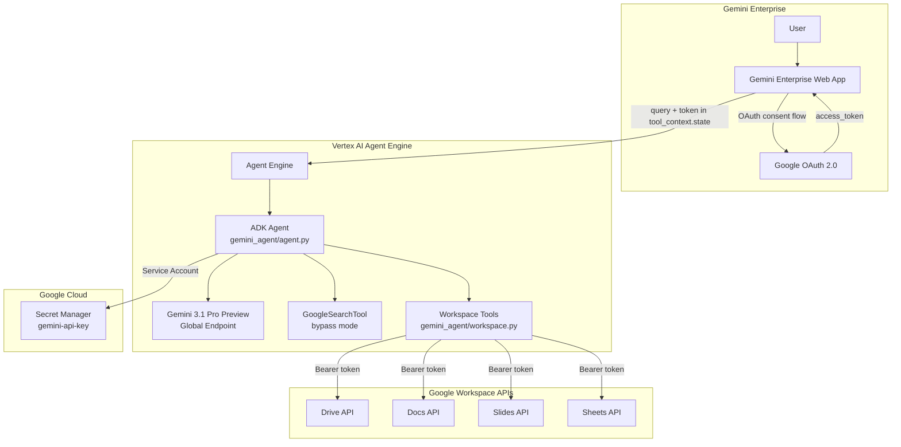

# Easy Gemini Agent Engine

Gemini ADK agent with Google Search and Google Workspace tools, deployed to Vertex AI Agent Engine and accessible via Gemini Enterprise.

## Architecture



## Features

- **Google Search** - Real-time web search via `GoogleSearchTool(bypass_multi_tools_limit=True)`
- **Google Drive** - Search files in user's Drive
- **Google Docs** - Read document content
- **Google Slides** - Read presentation content
- **Google Sheets** - Read spreadsheet data
- **Thinking (HIGH)** - Enhanced reasoning capabilities
- **Gemini 3.1 Pro Preview** model with global endpoint

## Prerequisites

- Python 3.11+
- Google Cloud project with billing enabled
- `gcloud` CLI installed and authenticated
- OAuth 2.0 Client ID (for Workspace tools)
- Gemini Enterprise app (for end-user access)

## Quick Start

### 1. Set up GCP resources

```bash
export PROJECT_ID="your-project-id"
bash scripts/setup_gcp_prerequisites.sh
```

### 2. Deploy to Agent Engine

```bash
python scripts/deploy_agent_engine.py --project $PROJECT_ID
```

Save the `Resource Name` from the output — you'll need it for Gemini Enterprise registration.

### 3. Set up OAuth for Workspace tools

See [Gemini Enterprise Integration](#gemini-enterprise-integration) below.

### 4. Test the deployed agent

```bash
export RESOURCE_NAME="projects/.../reasoningEngines/..."
python scripts/test_agent_engine.py
```

## Gemini Enterprise Integration

To enable Google Workspace document access for end users, you need to:

1. **Create OAuth 2.0 credentials**
2. **Create an Authorization resource** in Gemini Enterprise
3. **Register the agent** with `toolAuthorizations`

### Step 1: Create OAuth 2.0 Client

In Google Cloud Console > APIs & Services > Credentials:

- Create an **OAuth 2.0 Client ID** (Web application)
- Add **Authorized redirect URIs**:
  - `https://vertexaisearch.cloud.google.com/oauth-redirect`
  - `https://vertexaisearch.cloud.google.com/static/oauth/oauth.html`

### Step 2: Construct Authorization URI

Build the Authorization URI with your OAuth Client ID:

```
https://accounts.google.com/o/oauth2/v2/auth?
  client_id=YOUR_CLIENT_ID&
  redirect_uri=https%3A%2F%2Fvertexaisearch.cloud.google.com%2Fstatic%2Foauth%2Foauth.html&
  scope=https%3A%2F%2Fwww.googleapis.com%2Fauth%2Fdrive.readonly%20
        https%3A%2F%2Fwww.googleapis.com%2Fauth%2Fdocuments.readonly%20
        https%3A%2F%2Fwww.googleapis.com%2Fauth%2Fpresentations.readonly%20
        https%3A%2F%2Fwww.googleapis.com%2Fauth%2Fspreadsheets.readonly%20
        https%3A%2F%2Fwww.googleapis.com%2Fauth%2Fcloud-platform&
  include_granted_scopes=true&
  response_type=code&
  access_type=offline&
  prompt=consent
```

### Step 3: Create Authorization Resource

```bash
AUTH_ID="workspace-tools"
PROJECT_NUMBER=$(gcloud projects describe $PROJECT_ID --format='value(projectNumber)')

curl -X POST \
  -H "Authorization: Bearer $(gcloud auth print-access-token)" \
  -H "Content-Type: application/json" \
  -H "X-Goog-User-Project: $PROJECT_ID" \
  "https://discoveryengine.googleapis.com/v1alpha/projects/$PROJECT_NUMBER/locations/global/authorizations?authorizationId=$AUTH_ID" \
  -d '{
    "displayName": "Workspace Tools Auth",
    "server_side_oauth2": {
      "client_id": "YOUR_OAUTH_CLIENT_ID",
      "client_secret": "YOUR_OAUTH_CLIENT_SECRET",
      "token_uri": "https://oauth2.googleapis.com/token",
      "authorization_uri": "YOUR_AUTHORIZATION_URI_FROM_STEP_2"
    }
  }'
```

### Step 4: Register Agent in Gemini Enterprise

```bash
APP_ID="your-gemini-enterprise-app-id"
REASONING_ENGINE_ID="your-reasoning-engine-id"

curl -X POST \
  -H "Authorization: Bearer $(gcloud auth print-access-token)" \
  -H "Content-Type: application/json" \
  -H "X-Goog-User-Project: $PROJECT_ID" \
  "https://discoveryengine.googleapis.com/v1alpha/projects/$PROJECT_NUMBER/locations/global/collections/default_collection/engines/$APP_ID/assistants/default_assistant/agents" \
  -d '{
    "displayName": "Gemini Agent",
    "description": "Assistant with web search and Google Workspace document access",
    "adk_agent_definition": {
      "provisioned_reasoning_engine": {
        "reasoning_engine": "projects/PROJECT_NUMBER/locations/us-central1/reasoningEngines/REASONING_ENGINE_ID"
      }
    },
    "authorization_config": {
      "tool_authorizations": [
        "projects/PROJECT_NUMBER/locations/global/authorizations/workspace-tools"
      ]
    }
  }'
```

> **Important**: Use `tool_authorizations` (not `agent_authorization`). This field ensures the OAuth token is injected into `tool_context.state` when Workspace tools are called.

## Key Technical Details

### AFC Compatibility

Google Search and custom function tools cannot normally coexist (AFC gets disabled). This project uses `GoogleSearchTool(bypass_multi_tools_limit=True)` to convert Google Search into a function-calling compatible tool.

### OAuth Token Flow

When a user interacts with the agent via Gemini Enterprise:

1. User sends a query that requires Workspace access
2. Gemini Enterprise shows an **authorization button**
3. User authorizes via Google OAuth consent screen
4. Token is injected into `tool_context.state["workspace-tools"]`
5. Workspace tools use the token to call Google APIs on behalf of the user

### `CLIENT_AUTH_NAME`

The `CLIENT_AUTH_NAME` in `workspace.py` must match the Authorization resource ID created in Step 3. Default: `workspace-tools`.

## Project Structure

```
easy-gemini-agent-engine/
├── gemini_agent/
│   ├── __init__.py
│   ├── agent.py          # ADK agent with GoogleSearchTool + Workspace tools
│   └── workspace.py      # Google Workspace API tools (Drive, Docs, Slides, Sheets)
├── scripts/
│   ├── deploy_agent_engine.py       # Deploy/update Agent Engine
│   ├── setup_gcp_prerequisites.sh   # Set up GCP APIs, IAM, secrets
│   ├── test_agent_engine.py         # Test deployed agent
│   └── cleanup_agent_engines.py     # Delete all Agent Engines
├── docs/
│   └── plans/
├── pyproject.toml
└── README.md
```

## Scripts

| Script | Description |
|--------|-------------|
| `scripts/setup_gcp_prerequisites.sh` | Set up GCP APIs, service account, IAM, secrets |
| `scripts/deploy_agent_engine.py` | Deploy or update Agent Engine |
| `scripts/test_agent_engine.py` | Test deployed agent |
| `scripts/cleanup_agent_engines.py` | Delete all Agent Engines in project |

## Update Existing Deployment

```bash
python scripts/deploy_agent_engine.py --project $PROJECT_ID --update <RESOURCE_NAME>
```

## Local Development

```bash
# Install dependencies
uv sync

# Set API key for local testing
export GEMINI_API_KEY="your-api-key"

# Run with ADK dev UI
adk web gemini_agent
```
