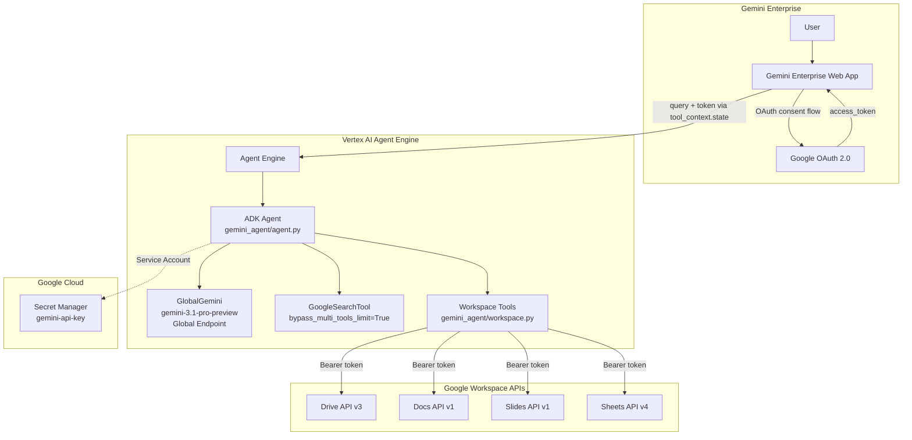
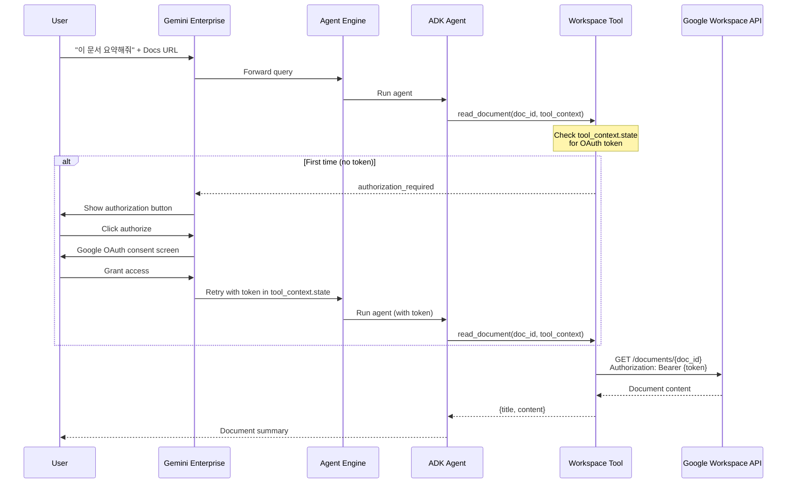

# Easy Gemini Agent Engine - Design Document

## Overview

Gemini ADK agent with Google Search and Google Workspace tools (Drive, Docs, Slides, Sheets), deployed to Vertex AI Agent Engine and accessible via Gemini Enterprise. Users authorize via OAuth 2.0, and the agent accesses their Workspace documents on their behalf.

## Architecture



### OAuth Token Flow



## Agent (`gemini_agent/agent.py`)

- **Model**: `GlobalGemini` subclass — forces `location="global"` (required for Gemini 3 models on Agent Engine)
- **Model name**: `gemini-3.1-pro-preview` (overridable via `AGENT_MODEL` env var)
- **Tools**:
  - `GoogleSearchTool(bypass_multi_tools_limit=True)` — enables AFC compatibility with custom functions
  - `search_drive` — search user's Google Drive
  - `read_document` — read Google Docs content
  - `read_presentation` — read Google Slides content
  - `read_spreadsheet` — read Google Sheets content
- **Thinking**: HIGH level
- **API Key**: Loaded from `GEMINI_API_KEY` env var or Secret Manager (`gemini-api-key` secret)

### AFC Compatibility

Built-in tools (`google_search`, `url_context`) are non-callable and disable Automatic Function Calling (AFC) when mixed with custom Python functions. Solution: `GoogleSearchTool(bypass_multi_tools_limit=True)` converts it to a function-calling compatible tool. `url_context` does not support this flag, so it is not used.

## Workspace Tools (`gemini_agent/workspace.py`)

OAuth token resolution order:

1. `tool_context.state["workspace-tools"]` — exact AUTH_ID key (Gemini Enterprise injection)
2. `tool_context.state["workspace-tools_<number>"]` — numbered key pattern (codelab format)
3. Any long string value in state — fallback token detection
4. ADK `get_auth_response` / `request_credential` — explicit OAuth flow trigger

`CLIENT_AUTH_NAME` must match the Authorization resource ID registered in Gemini Enterprise.

### Required OAuth Scopes

| Scope | Purpose |
|-------|---------|
| `drive.readonly` | Search Drive files |
| `documents.readonly` | Read Google Docs |
| `presentations.readonly` | Read Google Slides |
| `spreadsheets.readonly` | Read Google Sheets |
| `cloud-platform` | General Cloud API access |

## Deployment Pipeline

### Deploy Script (`scripts/deploy_agent_engine.py`)

- Args: `--project`, `--update`, `--region`, `--staging-bucket`, `--oauth-client-id`, `--oauth-client-secret`
- Uses `agent_engines.AdkApp` with `enable_tracing=True`
- `extra_packages=["./gemini_agent"]`
- Dependencies: `google-adk`, `google-cloud-aiplatform`, `google-cloud-secret-manager`, `google-api-python-client`, `google-auth`, `nest-asyncio`, `python-dotenv`

### Gemini Enterprise Registration (REST API)

Two-step process via Discovery Engine API:

1. **Create Authorization resource** — `POST /authorizations?authorizationId=workspace-tools`
   - Requires: OAuth Client ID, Client Secret, Token URI, Authorization URI
   - Authorization URI must use `redirect_uri=.../static/oauth/oauth.html`
   - Must include `access_type=offline` and `prompt=consent`

2. **Register Agent** — `POST /assistants/default_assistant/agents`
   - Must use `authorization_config.tool_authorizations` (NOT `agent_authorization`)
   - `tool_authorizations` ensures token is injected into `tool_context.state`
   - Links to the Authorization resource and Reasoning Engine

### OAuth Client Redirect URIs

Both must be added to the OAuth Client's Authorized redirect URIs:

- `https://vertexaisearch.cloud.google.com/oauth-redirect`
- `https://vertexaisearch.cloud.google.com/static/oauth/oauth.html`

## Project Structure

```
easy-gemini-agent-engine/
├── gemini_agent/
│   ├── __init__.py
│   ├── agent.py          # ADK agent: GlobalGemini + GoogleSearchTool + Workspace tools
│   └── workspace.py      # Workspace tools: Drive, Docs, Slides, Sheets
├── scripts/
│   ├── deploy_agent_engine.py       # Deploy/update Agent Engine
│   ├── setup_gcp_prerequisites.sh   # GCP APIs, IAM, secrets setup
│   ├── test_agent_engine.py         # Test deployed agent
│   └── cleanup_agent_engines.py     # Delete all Agent Engines
├── docs/
│   └── plans/
│       ├── 2026-03-09-easy-gemini-agent-engine-design.md  # This file
│       └── 2026-03-09-easy-gemini-agent-engine-impl.md    # Implementation plan
├── pyproject.toml
└── README.md
```

## Dependencies

| Package | Purpose |
|---------|---------|
| `google-adk>=1.15.0` | ADK agent framework |
| `google-cloud-aiplatform[agent-engines]>=1.128.0` | Agent Engine deployment |
| `google-cloud-secret-manager>=2.16.0` | API key retrieval |
| `google-api-python-client>=2.100.0` | Google Workspace APIs |
| `google-auth>=2.20.0` | OAuth credentials |
| `nest-asyncio>=1.5.0` | Agent Engine event loop compatibility |
| `python-dotenv>=1.0.0` | Environment variable loading |

## Key Decisions

| Decision | Rationale |
|----------|-----------|
| `GoogleSearchTool(bypass_multi_tools_limit=True)` | Only way to use Google Search alongside custom function tools (AFC compatibility) |
| No `url_context` | Doesn't support `bypass_multi_tools_limit`, cannot coexist with custom tools |
| `GlobalGemini` subclass | Gemini 3 models require global endpoint, Agent Engine overrides location |
| `tool_authorizations` (not `agent_authorization`) | Required for token injection into `tool_context.state` |
| `redirect_uri=static/oauth/oauth.html` | Required by Gemini Enterprise OAuth flow |
| Read-only scopes | Minimum privilege for document reading |
